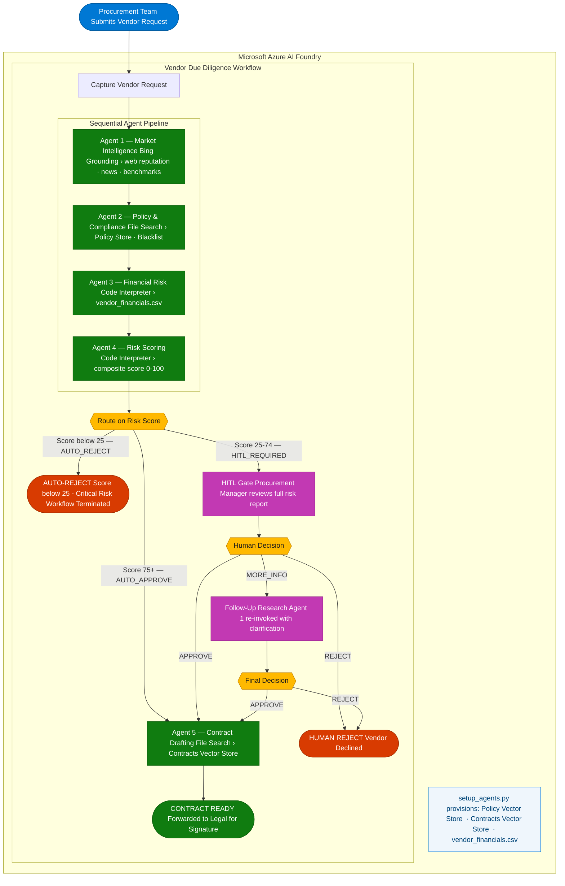

# Foundry Vendor Due Diligence Workflow

A multi-agent **Human-in-the-Loop** workflow built on **Microsoft Foundry Agent Service** that automates vendor procurement due diligence for Contoso Corp.

---

## What This Showcases

| Feature | Agent | Tool |
|---|---|---|
| Real-time web search | Market Intelligence | Bing Grounding |
| RAG over internal docs | Policy & Compliance | File Search |
| Python code execution + chart generation | Financial Risk | Code Interpreter |
| Algorithmic risk scoring | Risk Scoring | Code Interpreter |
| Human approval gate | Workflow node | Human-in-the-Loop (HITL) |
| Conditional routing | Workflow | If/Else logic node |
| Document generation | Contract Drafting | File Search |
| Structured outputs | All agents | JSON Schema response format |

---

## Project Structure

```
Foundry-Workflow/
├── .env.example                          # Environment variable template (for setup script)
│
├── scripts/
│   └── setup_agents.py                   # Automated setup — uploads files, creates agents
│
├── mock-data/                            # All mock/synthetic data files
│   ├── vendor_financials.csv             # 10 vendor financial records (Code Interpreter)
│   ├── procurement_policy.md             # Contoso procurement policy (File Search)
│   ├── vendor_blacklist.md               # 7 blacklisted vendors (File Search)
│   └── contract_templates/
│       └── standard_vendor_contract.md  # Vendor agreement template (File Search)
│
├── agents/                               # Agent definitions (instructions + tool config)
│   ├── 01-market-intelligence-agent.yaml # Bing Grounding
│   ├── 02-policy-compliance-agent.yaml   # File Search (policy + blacklist)
│   ├── 03-financial-risk-agent.yaml      # Code Interpreter (CSV + charting)
│   ├── 04-risk-scoring-agent.yaml        # Code Interpreter (scoring algorithm)
│   └── 05-contract-drafting-agent.yaml   # File Search (contract templates)
│
├── workflow/
│   └── vendor-due-diligence-workflow.yaml  # Declarative workflow YAML (reference)
│
└── function-tools/
    └── risk_scoring_api.py               # Mock function tool (risk scoring logic)
```

---

## Workflow Architecture



---

## Setup Guide

### Prerequisites
- Azure subscription with a **Foundry project** created ([create one here](https://ai.azure.com))
- `az login` completed (uses `DefaultAzureCredential`)
- Python 3.10–3.13
- A **Bing Search** connection configured in your Foundry project (Settings → Connections)
- A deployed model (e.g., `gpt-4o`) in your Foundry project

### Option A — Automated Setup (Recommended)

A single Python script uploads all mock-data files, creates vector stores, and registers
all 5 agents in your Foundry project. You only need to build the workflow afterwards.

#### 1. Configure environment

```bash
cp .env.example .env
```

Edit `.env` and fill in **three values**:
- `FOUNDRY_PROJECT_ENDPOINT` — your project endpoint (format: `https://<resource>.ai.azure.com/api/projects/<project>`)
- `FOUNDRY_MODEL_DEPLOYMENT_NAME` — your deployed model name (e.g., `gpt-4o`)
- `BING_CONNECTION_NAME` — the Bing Search connection name from your project's Settings → Connections

#### 2. Install dependencies and run

```bash
pip install azure-ai-projects azure-identity python-dotenv
python scripts/setup_agents.py
```

The script will:
- Upload all 4 mock-data files via the Foundry Files API
- Create 2 vector stores (policy docs + contract templates)
- Create all 5 agents with their tools and files already attached
- Print a summary of all created resource IDs

> **Note:** File and vector store operations use the **SDK/REST API** — the Foundry portal
> does not have a standalone file upload page. Files are managed programmatically or
> attached inline when creating/editing agents in the portal.

#### 3. Create the workflow

1. In the Foundry portal, go to **Build → Workflows → Create new → Sequential**
2. Add **Invoke agent** nodes and other nodes to match the workflow flow diagram above.
   Use the agent names printed by the setup script (e.g., `market-intelligence-agent`).
3. Alternatively, toggle the **YAML Visualizer View** (Build tab → YAML toggle on the
   right) and paste the content of `workflow/vendor-due-diligence-workflow.yaml` as a
   starting reference. Review and adjust node-to-agent assignments as needed.
4. **Save** (Foundry does not auto-save) and click **Run Workflow** to test.
5. Use the test scenarios from the [Testing the Workflow](#testing-the-workflow) section below.


> **VS Code alternative:** Install the [Microsoft Foundry for VS Code](https://marketplace.visualstudio.com/items?itemName=TeamsDevApp.vscode-ai-foundry)
> extension. Open the workflow YAML, edit it, and select **Deploy** to push changes
> back to your Foundry project. You can also test workflows in the Remote Agent Playground.

---

### Option B — Manual Portal Setup

If you prefer creating everything through the Foundry portal UI:

#### 1. Create agents in the portal

For each agent, go to **Build → Agents → Create agent**:

| # | Agent Name | Tool to Add | Files to Attach |
|---|---|---|---|
| 1 | `market-intelligence-agent` | Bing Grounding | — (select your Bing connection) |
| 2 | `policy-compliance-agent` | File Search | `procurement_policy.md` + `vendor_blacklist.md` |
| 3 | `financial-risk-agent` | Code Interpreter | `vendor_financials.csv` |
| 4 | `risk-scoring-agent` | Code Interpreter | — (scoring algorithm is embedded in instructions) |
| 5 | `contract-drafting-agent` | File Search | `standard_vendor_contract.md` |

**How to attach files when creating an agent:**
- For **File Search** agents: when adding the File Search tool, the portal lets you
  upload files that will be indexed into a new vector store.
- For **Code Interpreter** agents: when adding the Code Interpreter tool, attach the
  CSV file directly. The portal supports CSV uploads for Code Interpreter.
- For the **Risk Scoring** agent: add the Code Interpreter tool. The scoring
  algorithm is embedded in the agent's instructions and runs via Code Interpreter.

Copy the instructions from each `agents/*.yaml` file into the agent's **Instructions** field.

#### 2. Create the workflow

Same as Option A, Step 3 above.

> **Important:** The `.env.example` file in this repo is used exclusively by the
> `scripts/setup_agents.py` automation script. If you set up everything manually
> through the portal, you do not need the `.env` file at all.

### Test the risk scoring function locally

```bash
python function-tools/risk_scoring_api.py
```

This runs 3 test cases showing Low, High, and Auto-Reject scoring scenarios.

> **Note:** The `risk_scoring_api.py` file contains the reference implementation of the
> scoring algorithm. The same algorithm is embedded in Agent 4's instructions so it can
> execute via Code Interpreter within the Foundry workflow. The standalone file is kept
> for local testing and as the source of truth for the algorithm.

---

## Testing the Workflow

After saving the workflow in the Foundry canvas, click **Run Workflow** and paste one of the test inputs below. Each scenario exercises a different risk path through the pipeline.

| Test Input | Expected Path |
|---|---|
| Nexus Supply Co., USA, Manufacturing, $4.5M revenue | Low risk → AUTO_APPROVE → contract drafting |
| ShadeCraft Industries, Bangladesh, Textile | Blacklisted → AUTO_REJECT (score 0) |
| Redstone Materials, China, Raw Materials, $2.8M revenue | High risk → HITL_REQUIRED → you decide |

> **Tip:** For a more detailed prompt, try: *"Evaluate vendor Nexus Supply Co., a manufacturing company based in the USA with $4.5M revenue, for a $500,000 raw materials contract."*

### Expected Outcomes (from mock data)

| Vendor | Expected Outcome |
|---|---|
| Nexus Supply Co. (V001) | Low Risk → Auto-Approve |
| BluePeak Logistics (V002) | Low Risk → Auto-Approve |
| Redstone Materials (V003) | High Risk → HITL Required |
| ShadeCraft Industries (V006) | Blacklisted → Auto-Reject |
| Harbor Freight Systems (V008) | Medium Risk → Standard Approval |

---

## Next Steps

- [ ] Convert workflow YAML to Agent Framework Python code (VS Code → Generate Code button)
- [ ] Add evaluation dataset for agent quality scoring
- [ ] Optionally deploy scoring API as an Azure Function (currently runs via Code Interpreter)
- [ ] Add Application Insights telemetry
- [ ] Configure workflow guardrails in Foundry portal
- [ ] Add a `scripts/teardown_agents.py` to clean up created resources
